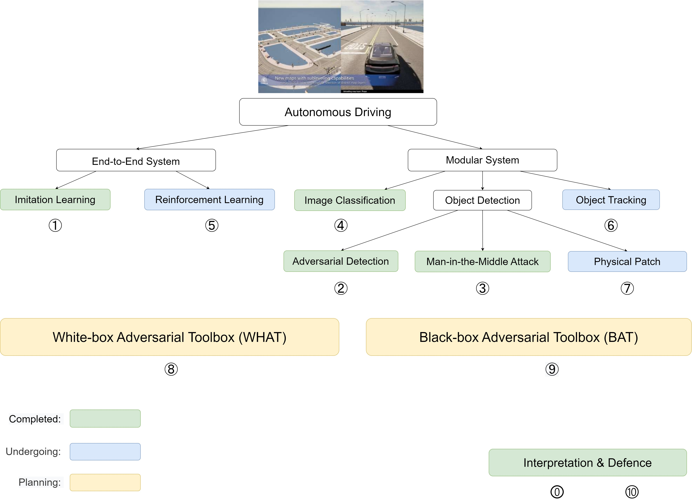

# Ph.D. in Computer Science

> University of Exeter

**Student**: Han Wu  
**Supervisors**: Prof. Johan Wahlström and Prof. Sareh Rowlands  
**Expected completion date**: 4/May/2024  

<h2><a href="https://wuhanstudio.uk"> Research Website</a></h2>

  

① Adversarial Driving: Attacking End-to-End Autonomous Driving System.

② Adversarial Detection: Attacking Object Detection in Real Time.

③ Man-in-the-Middle Attack against Object Detection System.

④ Distributed Black-box Attack against Image Classification.

⑤ Coming soon.

⑥ Coming soon.

⑦ Coming soon.

⑧ Interpretable Machine Learning for COVID-19.

⑨ Coming soon.
