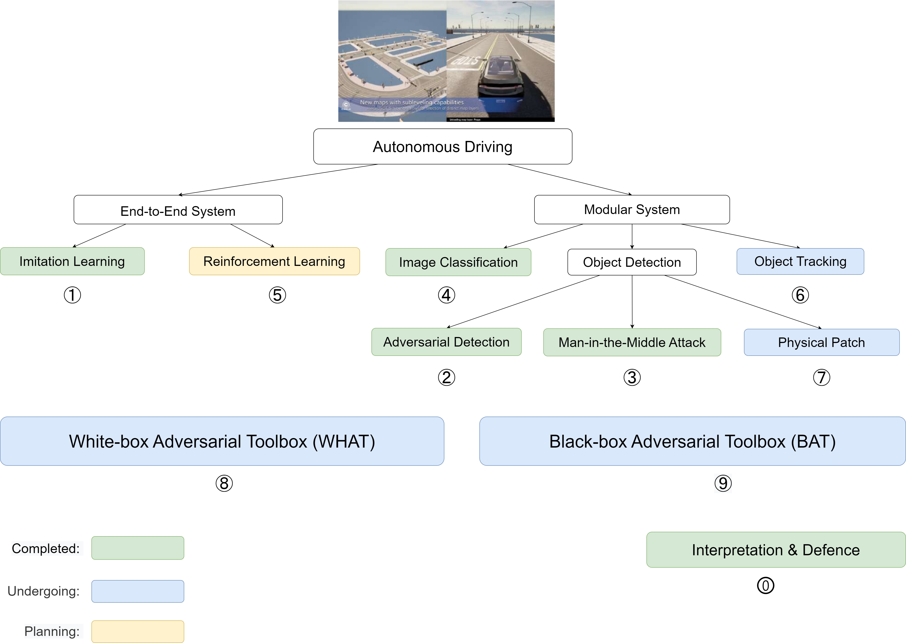

# Ph.D. in Computer Science

> University of Exeter

**Student**: Han Wu  
**Supervisors**: Prof. Johan Wahlström and Prof. Sareh Rowlands  
**Expected completion date**: 24/May/2024  

<h2><a href="https://wuhanstudio.uk"> Research Website</a></h2>

  

① Adversarial Driving: Attacking End-to-End Autonomous Driving System. [[Paper]](https://arxiv.org/abs/2103.09151)

② Adversarial Detection: Attacking Object Detection in Real Time. [[Paper]](https://arxiv.org/abs/2209.01962)

--------------------

③ A Man-in-the-Middle Attack against Object Detection System. [[Paper]](https://arxiv.org/abs/2208.07174)

④ Distributed Black-box Attack against Image Classification. [[Paper]](https://arxiv.org/abs/2210.16371)

---------------------

⑤ Coming soon.

--------------------

⑥ Adversarial Tracking: Real-time Adversarial Attacks against Object Tracking. [[Proposal]](files/Adversarial_Tracking.pdf)

⑦ Adversarial Patch: Physical Patch in Carla Simulator. [[Proposal]](files/Adversarial_Patch.pdf)

--------------------

⑧ A WHite-box Adversarial Toolbox (WHAT). [[GitHub]](https://github.com/wuhanstudio/whitebox-adversarial-toolbox)

⑨ A Black-box Adversarial Toolbox (BAT). [[GitHub]](https://github.com/wuhanstudio/blackbox-adversarial-toolbox)

--------------------

🄋 Interpretable Machine Learning for COVID-19. [[Paper]](https://arxiv.org/abs/2010.02006)
