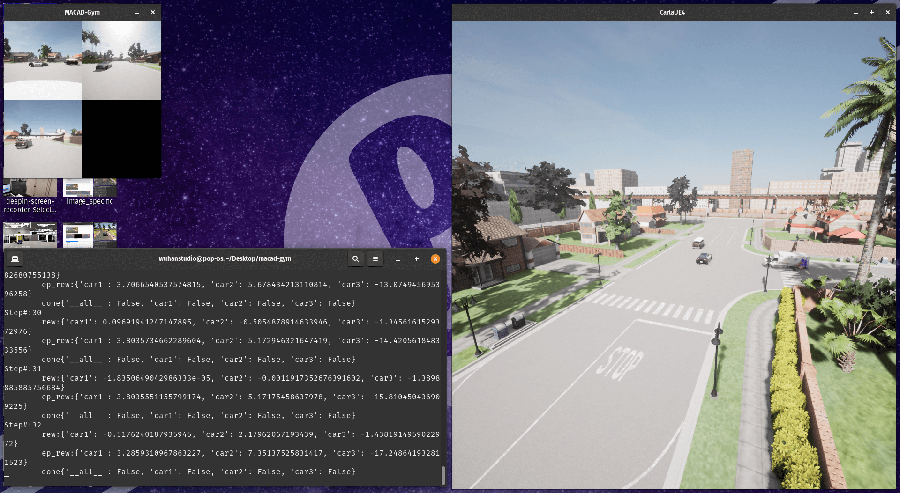

# Week 16

> 2023/01/09 - 2023/01/15

## Multi-Agent Connected Autonomous Driving (MACAD)

[https://github.com/praveen-palanisamy/macad-gym](https://github.com/praveen-palanisamy/macad-gym)

**OpenAI Gym environment**

- Environments: 

  - Hete Ncom | Inde | PO Intrx MA | TLS 1B2C1P TWN3-v0

  - **Homo Ncom | Inde | PO Intrx MA | SS 3C TWN3-v0**

- Observation Space: Images (168 x 168 x 3).

- Action Space: 9 discrete actions.

## RL Methods

**Baseline**

- [Deep Q (2013)](https://arxiv.org/abs/1312.5602)
- [DDPG (2015)](https://arxiv.org/abs/1509.02971)
- [A3C (2016)](https://arxiv.org/abs/1602.01783)

**Advanced**

- [HER (2017)](https://arxiv.org/abs/1707.01495)
- [SAC (2018)](https://proceedings.mlr.press/v80/haarnoja18b)
- [TD3 (2019)](https://spinningup.openai.com/en/latest/algorithms/td3.html)
