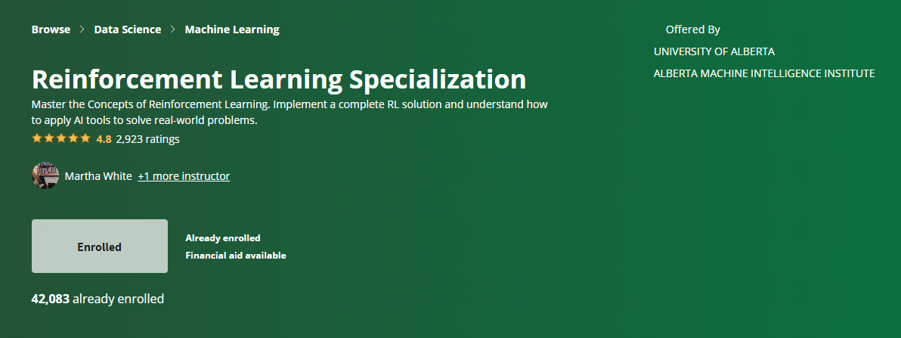
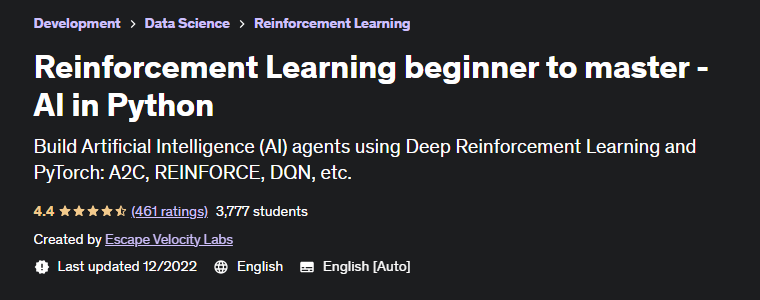
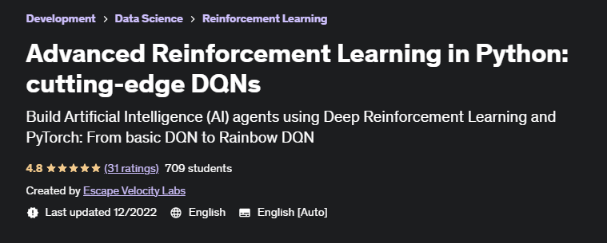
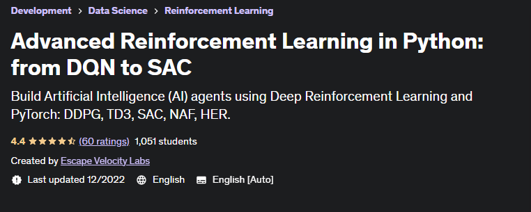

# Week 8

> 2023/02/27 - 2023/03/05

## Research Plan

- Jan. Reinforcement Learning  
- Feb. Reinforcement Learning  
 
- **Mar. Object Tracking**  
- **Apr. Object Tracking**  
 
- May. WHAT & BAT (Resubmission)

## Reinforcement Learning

Four Courses on Coursera:

Four Courses on Udemy:

Two Books:

- **RL Theory**: [Reinforcement Learning (Sutton & Barto, 2nd Edition)](https://www.andrew.cmu.edu/course/10-703/textbook/BartoSutton.pdf)
- **RL Practice**: [Reinforcement Learning: Industrial Applications of Intelligent Agents](https://rl-book.com/)

## Deep Q Network

- Double DQN
- Dueling DQN
- Prioritized Experience Replay
- Noisy DQN
- N-step DQN
- Distributional DQN

## Reinforcement Learning

[●] Deep SARSA  
[●] Deep Q Network  

[●] REINFORCE  
[●] A2C / A3C  

[●] GAE / NAF / HER  

[●] DDPG  
[●] TRPO & PPO  

[●] SAC  
[●] TD3  
