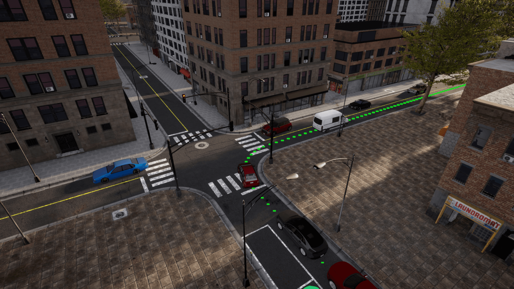

# Week 22

> 2023/06/05 - 2023/06/11

## Research Plan

- Jun. Adversarial Tracking  

## Environment

- Carla 0.9.14  
- Python 3.8  
 
- [ROS Bridge](https://github.com/carla-simulator/ros-bridge)  
 
- [Carla Leaderboard](https://github.com/carla-simulator/leaderboard)  
- [Open SCENARIO](https://github.com/carla-simulator/scenario_runner)  
 
- [LAV Driving Model](https://dotchen.github.io/LAV/)  

## Target Model

- [Monocular 3D Object Tracking](https://github.com/SysCV/qd-3dt)

## Adversarial Attacks

- Universal Adversarial Perturbation (UAP)

## Next Step

- [Learning from All Vehicles](https://arxiv.org/abs/2203.11934)  
- [Multimodal 3D Object Detection from Simulated Pretraining](https://arxiv.org/abs/1905.07754)  
 
- [Joint Monocular 3D Vehicle Detection and Tracking](https://arxiv.org/abs/1811.10742)  
- [Monocular Quasi-Dense 3D Object Tracking](https://arxiv.org/abs/2103.07351)  

 

