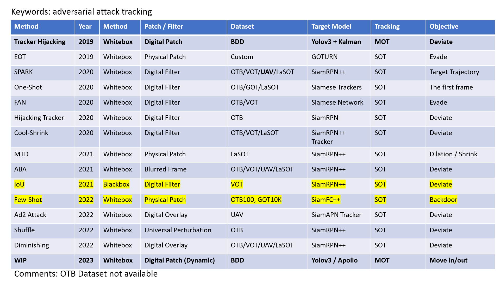

# Universal Adversarial Perturbations

> 2023/10/09 - 2023/10/15

- [Introduction to ISCA and High Performance Computing](https://docs.jade.ac.uk/en/latest/jade/scheduler/) (2 sessions 1pm – 4pm: 1st and 8th November, Training Room 4, Old Library)  
- Exeter Open Research Winner Award Presentation (22nd November, 11:30am – 12:30pm, Laver LT3)  

 

- [Siamese Network and Tracking](https://www.cs.cmu.edu/~rsalakhu/papers/oneshot1.pdf)  
    - One-shot Image Recognition  
    - Face Recognition  
    - Signature Verification  
     
    - Learns a similarity function  
     
    - Triplet Loss  
    - Contrastive Loss  

     

|                         | KITTI |                         CARLA      |
| :---------------------- | :---: | :---------------------------------------------------: |
|Dataset (Ground Truth)  |   [x](https://www.cvlibs.net/datasets/kitti/eval_tracking.php)   |           [x](https://npm3d.fr/kitti-carla)  |
|Tracking (Model Output) |       | [x](https://github.com/wuhanstudio/2d-carla-tracking) |
|Evaluation              |   -   |                           -       |
|Attack                  |       |                                                       |

 

