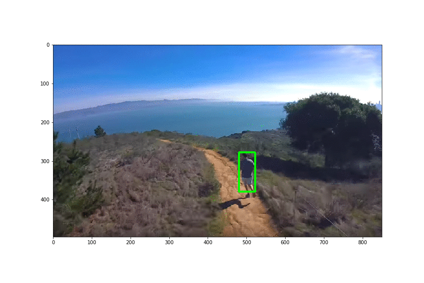
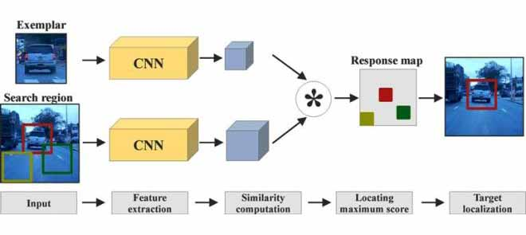

# Week 4

> 2023/10/16 - 2023/10/22

## High Order Tracking Accuracy (HOTA)

|                         | KITTI |                         CARLA      |
| :---------------------- | :---: | :---------------------------------------------------: |
|Dataset (Ground Truth)  |   [x](https://www.cvlibs.net/datasets/kitti/eval_tracking.php)   |           [-](https://npm3d.fr/kitti-carla)  |
|Tracking (Model Output) |   [x](https://github.com/wuhanstudio/2d-kitti-tracking)    | [x](https://github.com/wuhanstudio/2d-carla-tracking) |
|Evaluation              |   x   |                           -       |
|Attack                  |       |                                                       |

 

|         HOTA                | KITTI |                         CARLA      |
| :---------------------- | :---: | :---------------------------------------------------: |
|Ground Truth  |   100.00   |             |
|Ground Truth (Strong SORT)  |  93.72    |                |
|Ground Truth (Deep SORT)  |   85.55  |           |
|Ground Truth (SORT) |  84.62     |   |
| **CWIT** |  **66.31**     |   |
|YOLO (Strong SORT)  |  55.17  |               |
|YOLO (Deep SORT)  |   51.99   |           |
|YOLO (SORT) |    50.63   |   |

## Siamese Tracking (SOT)

## Physical Patch

