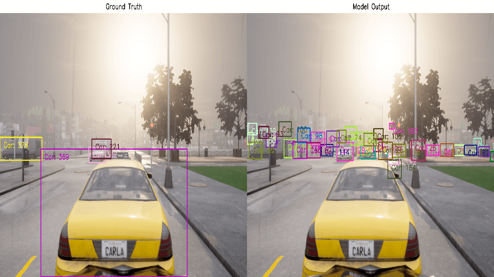

# Universal Adversarial Perturbations

> 2023/11/13 - 2023/11/19

## Research Plan

- Jan. Reinforcement Learning  
- Feb. Reinforcement Learning  
 
- Mar. [Research Proposal](week_27.html)  
 
- Apr. Man-in-the-Middle - WHAT (IEEE IV & BMVC)  
- May. Distributed Black-Box - BAT (IEEE IV & BMVC)  
 
- Jun. Carla Simulator  
- Jul. [3D Detection](week_43.html)  
- Aug. Object Tracking  
 
- Sep. [Data Study Group & International Welcome Team](week_50.html)  
 
- Oct. [Review & Evaluation](week_52.html)  
- Nov. Universal Adversarial Perturbations (IEEE TAI)  
- Dec. UAPs
